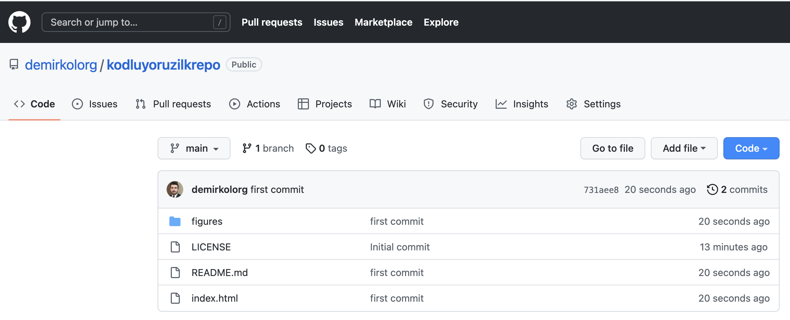

# Kodluyoruz İlk Repo

Abdullah Demirkol'a patika.dev sitesinde [ademirkol](https://app.patika.dev/ademirkol) kullanıcı adı ile ulaşabilirsiniz.

Bu repo  [Kodluyoruz](https://kodluyoruz.org) Front-End Eğitiminde oluşturduğumuz ilk repo. İçerisinde 1 adert README ve 1 adet index.html dosyası barındırıyor.



## Installation
Öncelikle projeyi clonlayın.
 ```
 git clone https://github.com/demirkolorg/kodluyoruzilkrepo.git
 ```

 ## Usage
 projeyi cloneladıktan sonra Visual Studio Code programında açınız.

 Linux için.

 ```
 cd kodluyoruzilkrepo
 code .
 ```

 ## Contributing
 Pull requestler kabul edilir. Büyük değişiklikler için, lütfen önce neyi değiştirmek istediğinizi tartışmak için bir konu açın.

 ## License
 [MIT](https://choosealicense.com/liceses/mit)